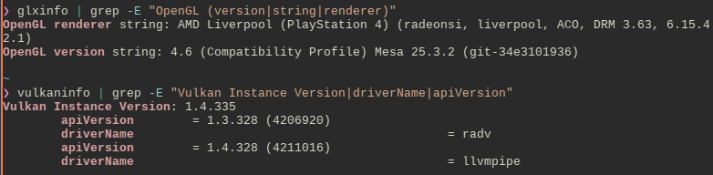

# PS4 up-to-date drivers for Arch Linux
These are up-to-date drivers with patches to work on the PS4 console.



> [!TIP]
> You can take the up-to-date patches and apply them on mesa-git as well, if you want to compile for every distro. I use Arch solely because it's easier to patch and less of a pain in the ass than Gentoo.

Here there are all of the PKGBUILDs that you need to build your own. They have been modified in the sense that they add patch files which allows them to do fix compatibility with the PS4.

This fork uses the latest stable releases instead of the mesa-git ones, as I don't want to deal with in-development stuff to patch.

## Binaries
For the binary repository, add these lines into `/etc/pacman.conf`
```bash
[ps4-video]
SigLevel = Optional 
Server = https://dionkill.github.io/ps4-video-archlinux/repo/
```

## Replicate this repository
Build tools
```bash
sudo pacman -S --needed \
  base-devel git devtools \
  meson ninja python-mako \
  libx11 libxrandr libxinerama \
  llvm clang wayland-protocols \
  libxcb xcb-proto
```

Add this line in `PKGBUILD`, before build section:
```
prepare() {
  cd $_pkgbasename-$pkgver
  patch -Np1 -i "$srcdir/ps4-libdrm.patch"
}
```

Update the signatures by running:
`updpkgsums`

Then, use `makepkg -s` to build.

If it doesn't build because of a PGP error:
- take that key in the error, run `gpg --keyserver keyserver.ubuntu.com --recv-keys (KEY HERE)` and check that it's valid, then import it with `gpg --lsign-key (KEY HERE)`. don't use parenthesis.
- OR do this instead:
```bash
sudo pacman -Sy archlinux-keyring
sudo pacman-key --init
sudo pacman-key --populate archlinux
sudo pacman-key --refresh-keys
```
- OOOOOOR add `--skippgpcheck` to fix PGP errors if you can't otherwise!

